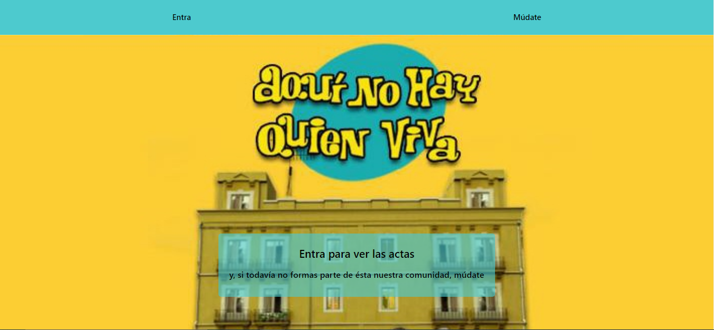
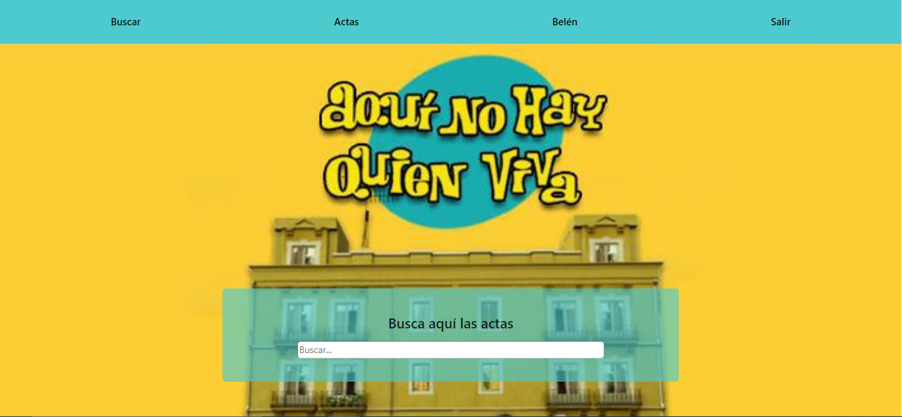
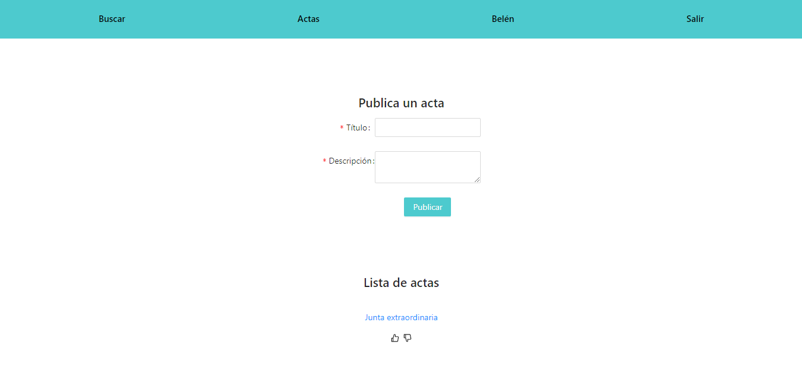
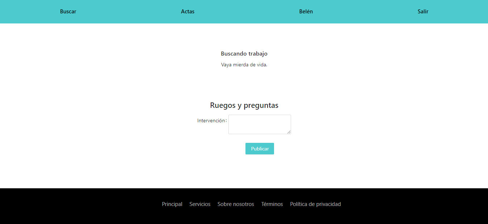
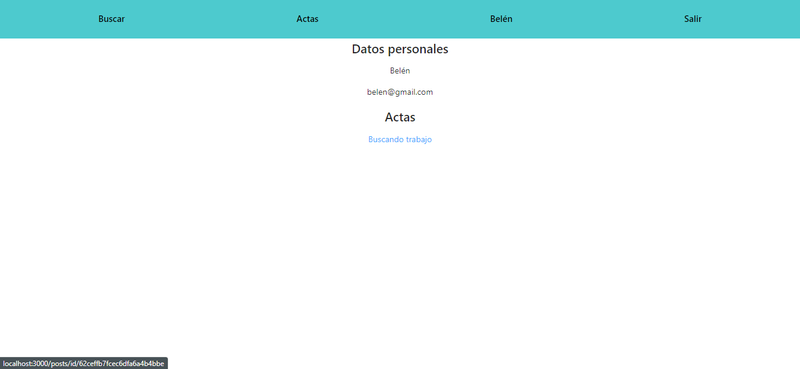
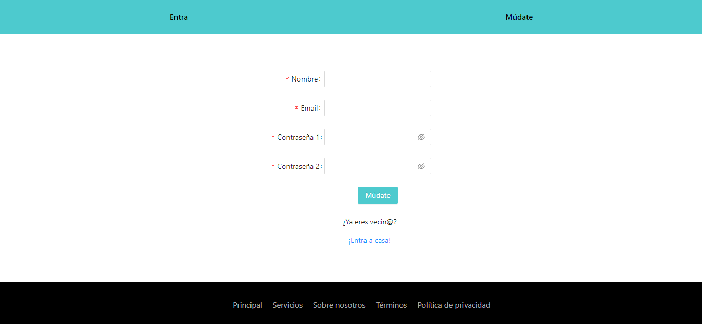
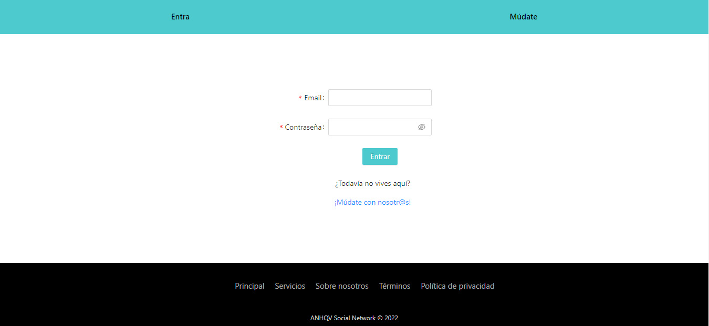

# Proecto MERN - ANHQV

## ÍNDICE

* Sobre el proyecto
    * Tecnologías utilizadas
    * Origen

* Requisitos

* Estructura

* Rutas

* Futuras implementaciones

* Autor

## Sobre el proyecto

### Tecnologías utilizadas

FrontEnd:
* JavaScript
* CSS
* Sass
* Ant Design
* React
* React-Redux
* React-Router
* React-Dom
* Axios

BackEnd:
* JavaScript
* Node.js
* Express
* MongoDB
* Mongoose

### Origen

Este proyecto se propuso como un ejercicio en el [bootcamp de FullStack Development de The Bridge](https://www.thebridge.tech/bootcamps/bootcamp-fullstack-developer) para poner en práctica los conocimientos adquiridos a lo largo de todo el curso. Consiste en crear una Red Social.

## Requisitos

[X] Registro de usuarios.

[X] Login de usuarios.

[X] Que se puedan ver las publicaciones y crear nuevas.

[X] Que se puedan editar y eliminar las publicaciones que hace el usuario logeado.

[X] Dar/quitar Like a post.

[X] Buscador de perfiles de usuario o de posts.

[X] Que en tu perfil puedas ver tus datos y tus posts.

[X] Que puedas comentar en las publicaciones.

[X] Uso de ramas con git, cuando se termine el proyecto deberán quedar dos ramas la master o main y la develop.

[X] Presentación de README excelente.

Componentes mínimos:

    [X] Register

    [X] Login

    [X] Home

    [X] Posts

        [X] Post

        [X] AddPost

    [X] Perfil. Vista perfil con los datos del usuario logeado y sus posts

    [X] Header

    [X] Footer

Implementa React Router en tu página:

    [X] /home. Home de la app

    [X] /login

    [X] /register

    [X] /profile

[X] Utilizar Redux

[X] Uso de SASS

[X] Importante el diseño

## Estructura de la página

Cada ruta construye una página con tres componentes: El Header y el Footer que son siempre iguales (con la excepción del Header que difiere entre modo Log In y modo Log Out) y el "Body" que es el componente que va variando en función de la ruta en la que te encuentras.

## Rutas

HOME:
* Modo Log Out:

* Modo Log In:

POSTS:

POSTDETAIL:

PROFILE:

REGISTER:

LOGIN:

## Futuras implementaciones:

[ ] Frontend disponible en producción (ej:Heroku)

[ ] El usuario puede seguir a otros usuarios y tener seguidores

[ ] CRUD de los comentarios

[ ] Que solo puedas editar y eliminar los comentarios que tu creas

[ ] El usuario puede subir fotos en los posts o cambiar su foto de perfil

[ ] El usuario puede dar likes a los comentarios de los posts

[ ] El usuario en su perfil puede ver el número de seguidores y número de a cuantos sigue

[ ] El usuario puede ver quien le sigue y a quién sigue

[ ] El usuario en su perfil puede ver los posts a los que le ha dado like

[ ] Implementación de guards

[ ] Que sea responsive

## Autores:

[Rebeca](https://github.com/RebecaASuesta)